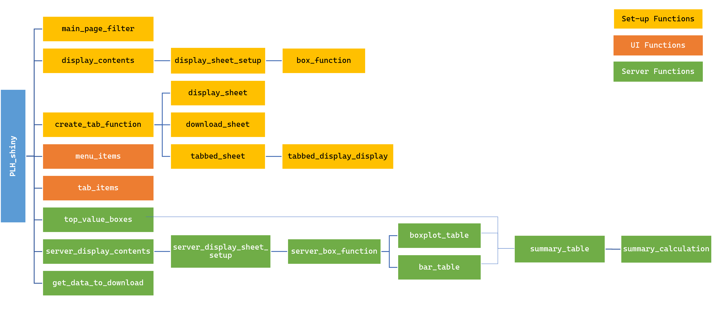

<!-- README.md is generated from README.Rmd. Please edit that file -->

# plhR

<!-- badges: start -->

[](https://github.com/IDEMSInternational/plhR/actions)
[](https://app.codecov.io/gh/IDEMSInternational/plhR?branch=main)
[](https://lifecycle.r-lib.org/articles/stages.html#experimental)
[](https://www.repostatus.org/#wip)
[-lightgrey.svg)](https://www.gnu.org/licenses/lgpl-3.0.en.html)
<!-- badges: end -->

A set of functions useful in analysing PLH data.

## Installation

You can install the development version of plhR from
[GitHub](https://github.com/) with:

``` r
# install.packages("devtools")
devtools::install_github("lilyclements/plhR")
```

## Example

This is a basic example which shows you how to solve a common problem:

``` r
library(plhR)
## basic example code
```

## Set Up


