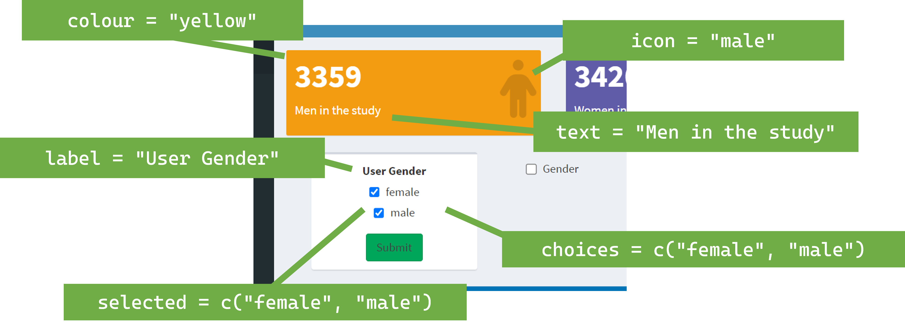

---
title: "Using Excel for Shiny Authoring System"
author: "Lily Clements"
date: "r Sys.Date()"
output: rmarkdown::html_vignette
vignette: >
  %\VignetteIndexEntry{Using Excel for Shiny Authoring System}
  %\VignetteEngine{knitr::rmarkdown}
  %\VignetteEncoding{UTF-8}
---

```{r setup, include=FALSE}
knitr::opts_chunk$set(
  collapse = TRUE,
  comment = "#>"
)
```


## Introduction

This vignette provides guidance on using different spreadsheet software options for creating your Shiny authoring system. We will cover:

- **Google Sheets**: Ideal for users who are frequently online. You can access Google Sheets by searching "Google Sheets" or [clicking here](https://www.google.com/sheets/about/).
- **Open Source Alternatives**: OpenOffice is a good open-source solution for spreadsheet needs. It can be downloaded from [this website](https://www.openoffice.org/download/).
- **Microsoft Excel**: The industry standard for spreadsheets. If you already have Microsoft Excel installed, it might be the most convenient option for you.

We provide solutions using Google Sheets, Office, and Microsoft Excel.

### Spreadsheet Components

When creating a spreadsheet for the Shiny authoring system, there are five key areas to be aware of:

1. **Contents**: General overview and metadata.
2. **Main Page**: Contains primary configuration settings.
3. **Display Page**: Details the individual display components.
4. **Tabbed Display Page**: Manages tabbed display sections.
5. **Download Page**: Handles downloadable content and related settings.

You can view a sample Excel spreadsheet on GitHub titled "nhanes_data.xlsx". This can be found under vignettes/data/.

### Example Code

Below is the R code needed to test the provided Excel spreadsheet and see how it integrates with the PLHShiny package:

```{r eval = FALSE}
library(rio)
library(ExcelToShiny)
library(readxl)
library(here)
library(shiny)
library(shinydashboard)
library(dplyr)
library(NHANES)

# Path to the example Excel file. Look under "vignettes/data/nhanes_data.xlsx"
example_excel <- rio::import_list("data/nhanes_data.xlsx")

# Load the NHANES dataset
data(NHANES)

# Prepare the data by selecting individual records
NHANES_by_ind <- NHANES %>%
  group_by(ID) %>%
  mutate(count = 1:n()) %>%
  filter(count == 1) %>%
  ungroup()

# Ensure that the ID column is in character format
NHANES_by_ind$ID <- as.character(NHANES_by_ind$ID)

# Source the credentials data
source("vignettes/data/credentials_data.R")

# Create the Shiny dashboard using the Excel file and prepared data
build_shiny(title = "Testing Shiny Dashboard",
            data_list = example_excel,
            data_frame = NHANES_by_ind,
            status = "primary",
            colour = "blue",
            key_var = "ID")
```

## Contents

We have several tabs on the excel sheet, and this tab in particular gives the **"Contents"**. This Contents sheet is the main tab for where you declare any excel sheets to read into Shiny. In the **"Contents"** tab, you will specify key information about other tabs in the spreadsheet, such as the name of each tab (e.g., Demographics, Parent Points, Workshop Engagement) which will correspond to menu items in the Shiny dashboard.

The **"Contents"** sheet should be the initial sheet and must be titled "contents". This sheet serves as a reference point for defining the various pages outlined in the sidebar.

Each page listed in the sidebar corresponds to its dedicated sheet within the spreadsheet, where the specific content for that page is outlined. The "Contents" tab, in essence, functions as the master reference for all these distinct spreadsheet sheets.

```{r include-image, echo=FALSE, fig.align='center', out.width = '70%'}

```

### Structure

- **Positioning**: The **"Contents"** tab must be the first sheet in your Excel file. It should be named exactly "contents" to ensure that the build_shiny() function correctly identifies and reads this tab.

- **Function**: This tab defines the menu items that appear in the Shiny sidebar. Each menu item corresponds to a separate sheet within the spreadsheet. For example, if you have a sheet named "Demographics", it will create a sidebar menu item labeled "Demographics".

There are four different options on the content tab: name, type, ID, and icon. Each row in the data frame corresponds to a new sheet in the spreadsheet software where the contents of that page in the dashboard is specified.  There are three different types of pages you can have on your shiny dashboard:

1. **Display** is a basic standard page displaying content in boxes in the dashboard.
2. **Tabbed_display** is used for displaying a page which contains tabs to new pages.
3. **Download** is used to display a page where you can download data.

The following table describes the variables used in the spreadsheet for creating Shiny dashboards.

| **Variable** | **Accepted Values**                          | **Description**                                                                                      |
|--------------|----------------------------------------------|------------------------------------------------------------------------------------------------------|
| name       | Any character variable                      | The name column represents the name of the tab/sheet in the spreadsheet other than the content tab. It takes any character variable value. |
| type       | "Display", "Download", or "Tabbed_display"  | In the type column, there are three distinct values: "Display", "Download", or "Tabbed_display". <br> - Display gives a single-sheet tab. <br> - Download provides a tab with the ability to view and download data. <br> - Tabbed_display gives a tab with multiple values. |
| ID         | Any character variable, no spaces           | Unique ID for the tab itself, must be unique. The ID should match the name of the spreadsheet tab. |
| icon       | A character variable                        | Here you can specify the icon to display. Refer to [FontAwesome](https://fontawesome.com/) for icon options. |

### Example of Contents
Here’s a sample of what the **"Contents"** tab might look like:

| Name          | Type            | ID              | Icon  |
|---------------|-----------------|-----------------|-------|
| Demographics  | Display          | demographics    | users |
| Diagnostics   | Tabbed_display   | td_diagnostics  | vial  |
| Download      | Download         | download        | download |

Each entry here corresponds to a different sheet in the spreadsheet, where the specific content for each page is defined. The **"Contents"** tab effectively acts as the master control panel for your dashboard’s structure and layout.

We can see where this links in with our sidebar pages on the name and icon:

```{r include-image2, echo=FALSE, fig.align='center', out.width = '70%'}

```

We can also see how the ID links to the sheet names

```{r include-image3, echo=FALSE, fig.align='center', out.width = '70%'}

```


## Main Page

The **"main_page"** tab in the spreadsheet holds any items to be visible or run on all pages of the Shiny dashboard. This tab must be named main_page in the spreadsheet document. 

An example of where this section is visible is provided below:

```{r include-image4, echo=FALSE, fig.align='center', out.width = '70%'}

```

Here we have three different components: value boxes, filtering, and group boxes. We will discuss these components in detail next.

### Options on main_page

- **Type**: value_box, filter_box, or group_by box
  - value_box: Displays a box at the top of the page showing quick summary statistics.
  - filter_box: Provides filtering options.
  - group_by_box: Provides grouping options.
- **Value**: Takes different values at the moment depending on what type is.
  - If type is value_box, then the options here are value_box (which gives the frequency of rows for the variable given in the variable parameter), mean_box (which gives the mean for the variable given in the variable parameter), and mean_sd_box (which gives the mean and SD for the variable given in the variable parameter)
  - If type is filter_box or group_by_box, then the only current option is “checkbox_group”. This gives a set of checkbox options.
- **Parameter List**: Parameters that the item declared in type takes. E.g., for value_box, parameters include "text", "colour", and "icon". For filter_box, parameters are "label", "choices", and "selected".
- **Variable** Name of the variable in the data displayed in the dashboard.
  - _Example_: If you want to display data for all individuals who are male, specify "gender" here.
- **Variable_value**: For value_box only, the variable value you wish to display that corresponds to the variable.
  - _Example_: If displaying data for "gender == 'males'", then "males" should be specified here.

| **type**     | **value**      | **parameter_list**                                                                                                     | **variable_value**                                             |
|--------------|----------------|-----------------------------------------------------------------------------------------------------------------------|---------------------------------------------------------------|
| value_box  | value_box    | Accepted values are: "text", "colour", "icon". These read into valueBox in Shiny.                             | The variable value you wish to display that corresponds to the variable. |
|              |                | - "text": The value for the "subtitle" parameter. This is the text displayed in the value box (e.g., "Males in the study"). |                                                               |
|              |                | - "icon": The icon parameter. The icon to display is found at [FontAwesome](https://fontawesome.com/).               |                                                               |
|              |                | - "colour": The colour of the box. Accepted values are: red, yellow, aqua, blue, light-blue, green, navy, teal, olive, lime, orange, fuchsia, purple, maroon, or black. See shinydashboard::validColors for the list. |   |
| value_box  | mean_box     | Same as above.                                                                                                         | Not relevant. |
| value_box  | mean_sd_box  | Same as above.                                                                                                       | Not relevant |
| filter_box | checkbox_group | Accepted values are any parameters read into checkboxGroupInput in Shiny. Most used are: "label", "choices", "selected". | Not relevant.                                                |
|              |                | - "label": Displayed label for the control, or NULL for no label.                                                   |                                                               |
|              |                | - "choices": List of values to show checkboxes for. Named elements will display names rather than values.           |                                                               |
|              |                | - "selected": Values that should be initially selected, if any.                                                       |   |
| group_by_box | checkbox_group | Accepted values are any parameters read into checkboxInput in Shiny. Most used are: "label", "value". | Not relevant.                                                |
|              |                | - "label": Displayed label for the control, or NULL for no label.                                                   |                                                               |
|              |                | - "choices": List of values to show checkboxes for. Named elements will display names rather than values.           |                                                               |
|              |                | - "selected": Values that should be initially selected, if any.                                                       |  |


### Detailed Options

#### For value_box

- **Accepted Values**:
  - "text": Text to display in the value box (e.g., "Males in the study").
  - "icon": Icon to display. Refer to [FontAwesome](https://fontawesome.com/) for options.
  - "colour": Colour of the box. Accepted colours are "red", "yellow", "aqua", "blue", "light-blue", "green", "navy", "teal", "olive", "lime", "orange", "fuchsia", "purple", "maroon", or "black". See shinydashboard::validColors for the list.

#### For filter_box

- **Accepted Values**:
  - "label": Displayed label for the control or NULL for no label.
  - "choices": List of values to show checkboxes for. Named elements will display names rather than values.
  - "selected": Values that should be initially selected, if any.

#### For group_by_box

- **Accepted Values**:
  - "label": Displayed label for the control or NULL for no label.
  - "value": This is TRUE or FALSE to denote if it is checked upon opening (TRUE) or not (FALSE).
  
### Example of main_page

Below is an example of the spreadsheet titled main_page:

| **type**       | **value**        | **parameter_list**                                                    | **variable** | **variable_value** |
|----------------|------------------|-----------------------------------------------------------------------|--------------|--------------------|
| value_box    | value_box      | text = "Men in the study", colour = "yellow", icon = "male"         | Gender     | male             |
| value_box    | value_box      | text = "Women in the study", colour = "purple", icon = "female"     | Gender     | female           |
| value_box    | mean_box       | text = "Average age", colour = "green", icon = "active"| Age |  |
| filter_box   | checkbox_group | label = "User Gender", choices = c("female", "male"), selected = c("female", "male")| Gender | |
| group_by_box | checkbox_group | label = "Gender", value = FALSE | Gender   |        |

We can see where these parameter_list values correspond to in the dashboard:

```{r include-image5, echo=FALSE, fig.align='center', out.width = '70%'}

```

## Display Page

As discussed in Contents, there are three types of pages that you can specify for your dashboard:

- Display page
- Tabbed display page
- Download page

This guide goes through a standard display page and the options given on it. An example of where this bit is visible is given below:

```{r include-image6, echo=FALSE, fig.align='center', out.width = '70%'}

```

We have boxes containing data. We look at how this is generated.

### Options on a Display Sheet

- **type**: Takes the option of box only at the moment.

- **value**: Takes different values depending on the type. However, the type is always box right now. The options are:
  - bar_freq: Provides a bar chart and frequency table.
  - boxplot_freq: Provides a box plot and frequency table.
  - bar_summary: Provides a bar chart and summary table.
  - boxplot_summary: Provides a box plot and summary table.
  - specify_summary: The user can specify the graphic and table as they wish. This is given under advanced.

- **parameter_list**: Parameters that the item declared in type takes. There are two values:
  - text: This is the text to display on the box.
  - colour: This is the colour of the box. Options are blue, green, light blue, orange, red.

- **variable**: Name of the variable in the data that you are displaying in the dashboard. For example, if you want to display the "one_on_one" module, you would put the variable that holds the "one_on_one" data (e.g., ID).

- **row**: Specifies which row to display this item on.

- **data**: You can specify further data frames, as long as you load them in your R file. You can specify this here.

### Example of Display Page

Below is an example of a display spreadsheet. Here, we have five boxes: two on row one, two on row two, and one on row three.

| type | value           | parameter_list                      | variable       | row | data          |
|------|-----------------|-------------------------------------|----------------|-----|---------------|
| box  | bar_table       | text = "Gender", colour = "blue"    | Gender         | 1   | NHANES_by_ind |
| box  | boxplot_summary | text = "Age", colour = "blue"       | Age            | 1   | NHANES_by_ind |
| box  | bar_table       | text = "Marital Status", colour = "blue" | MaritalStatus  | 2   | NHANES_by_ind |
| box  | bar_table       | text = "Race", colour = "blue"      | Race1          | 2   | NHANES_by_ind |
| box  | bar_table       | text = "Education Level", colour = "blue" | Education      | 3   | NHANES_by_ind |
| box  | bar_table       | text = "Household Income", colour = "blue" | HHIncome      | 3   | NHANES_by_ind |

We can see where these `parameter_list` values correspond to in the dashboard:

```{r include-image7, echo=FALSE, fig.align='center', out.width = '70%'}

```

### Advanced Features: Graph and Data Manipulations
Two additional columns you can use are `data_manip` and `graph_manip`. These allow for data and graphic manipulations.

Using `graph_manip`, you can add extra layers to your plots (`ggplot`) objects by adding layers. If you're familiar with `ggplot2`, this is straightforward where you just add in `ggplot2` code.

- E.g., `theme_minimal()` on the first row means we add `+ theme_minimal()` to the plot.
- E.g., `theme_minimal() + labs(x = "Taken Hard Drugs")` on the second row means we add `theme_minimal()` to the plot and label the `x` axis.

| type | value            | parameter_list                        | graph_manip                                   | variable  | row |
  |------|------------------|---------------------------------------|-----------------------------------------------|-----------|-----|
  | box  | bar_table        | text = "Taken Marijuana?", colour = "blue" | theme_minimal()                            | Marijuana | 1   |
    | box  | bar_table        | text = "Taken hard drugs?", colour = "blue" | theme_minimal() + labs(x = "Taken Hard Drugs") | HardDrugs | 2   |
      | box  | bar_table        | text = "Smoke now?", colour = "blue"  | theme_minimal() + labs(x = "Currently Smoke") | SmokeNow  | 3   |

```{r include-image-graphmanip, echo=FALSE, fig.align='center', out.width = '70%'}

```

`data_manip` is another column where you can add data manipulations. For example, if we wanted to look at the age that individuals with diabetes were diagnosed with diabetes, we would want to filter to look at only individuals with diabetes.

| type | value        | data_manip                      | parameter_list                        | graph_manip                                   | variable  | row |
|------|--------------|---------------------------------|---------------------------------------|-----------------------------------------------|-----------|-----|
| box  | boxplot_table    | %>% filter(Diabetes == "Yes") | text = "", colour = "blue" | theme_minimal() + labs(y = "Diabetes Age") | DiabetesAge | 4   |
              
Alternatively, you can use `filter_variable` and `filter_value` to filter to specific values:

- **filter_variable**: You may want to filter your data frame to display only certain values. 

- **filter_value**: You may want to filter your data frame to display only certain values.

| type | value        | parameter_list                        | graph_manip                                   | variable  | filter_variable | filter_value | row |
 |------|--------------|---------------------------------------|-----------------------------------------------|-----------|-----------------|--------------|-----|
| box  | boxplot_table    | text = "", colour = "blue" | theme_minimal() + labs(y = "Diabetes Age") | Diabetes | Yes | 4   |

```{r include-image-filter, echo=FALSE, fig.align='center', out.width = '70%'}

```

### Specify Plot

One option for `value` is `specify_plot`, where you can define the plot and table from scratch. You can specify the table under `table_manip` and the ggplot object under `graph_manip`.
                    
```{r eval = FALSE}
 %>% group_by(AgeDecade) %>% summarise(min(BPDiaAve))
```
                  
Under `graph_manip`:
                    
```{r eval = FALSE}
geom_point(aes(x = BPDiaAve, y = BPSysAve, colour = AgeDecade)) + labs(x = "Average Diastolic BP", y = "Average Systolic BP") + theme_minimal()
```
                  
| type | value        | data_manip | table_manip                                       | graph_manip                                                                            | parameter_list                                    | variable | variable_value | row | data          |
|------|--------------|------------|--------------------------------------------------|----------------------------------------------------------------------------------------|--------------------------------------------------|-----------|----------------|-----|---------------|
| box  | specify_plot | `<NA>`     | `%>% group_by(AgeDecade) %>% summarise(min(BPDiaAve))` | `geom_point(aes(x = BPDiaAve, y = BPSysAve, colour = AgeDecade)) + labs(x = "Average Diastolic BP", y = "Average Systolic BP") + theme_minimal()` | text = "Average Diastolic BP by Systolic BP", colour = "blue" | ID        | `<NA>`         | 1   | NHANES_by_ind |

```{r include-image-specify, echo=FALSE, fig.align='center', out.width = '70%'}

```

## Tabbed Display Page

As discussed in Contents, there are three types of pages that you can specify for your dashboard:

- Display page
- **Tabbed display page**
- Download page

This guide goes through a standard tabbed display page and the options given on it. An example of where this bit is visible is given below:

```{r include-image8, echo=FALSE, fig.align='center', out.width = '70%'}

```

The Tabbed Display sheet is straightforward: it functions similarly to the Contents sheet. Like Contents, the tabbed display sheet serves as a reference point for defining the various pages. This time, the various pages are outlined in the tabs on that page. The "tabbed display" tab, in essence, functions as the master reference for all these distinct spreadsheet sheets.

### Options on Tabbed Display Tab

There are three different options on the content tab: name, type, and ID. Each row in the spreadsheet corresponds to a new sheet in the spreadsheet software where the contents of that page in the dashboard are specified.

| **Variable** | **Accepted Values**                           | **Description**                                                  |
|--------------|------------------------------------------------|------------------------------------------------------------------|
| name       | Any character variable                        | The name to display for that tab.                               |
| type       | "Display", "Download", or "Tabbed_display"    | Display gives a single-sheet tab, Download allows viewing and downloading data, Tabbed_display gives a tab with multiple values. You probably would want Display here! |
| ID         | Any character variable, no spaces              | Unique ID for the tab itself; must be unique. This ID should match the name of the spreadsheet tab. |

### Example of Tabbed Display Page

Below is an example of the “contents” sheet in a spreadsheet for an authoring system:

| **name**     | **type**   | **ID**                        |
|--------------|------------|-------------------------------|
| Drugs Use      | Display    | td_diagnostics_drugs        |
| Blood Pressure | Display    | td_diagnostics_bp           |

We can see where this links in with our page here:

```{r include-image9, echo=FALSE, fig.align='center', out.width = '70%'}

```

## Download Page

As discussed in Contents, there are three types of pages that you can specify for your dashboard:

- Display page
- Tabbed display page
- **Download page**

This guide goes through a standard download page and the options given on it. An example of where this bit is visible is given below:

```{r include-image10, echo=FALSE, fig.align='center', out.width = '70%'}

```

The Download sheet is straightforward. We just need to specify the data to download.

### Options on Download Sheet

There are three different options on the content tab: type, name, and value. Each row in the spreadsheet corresponds to a new sheet in the spreadsheet software where the contents of that page in the dashboard are specified.

| **Variable** | **Accepted Values**                          | **Description**                                                                                      |
|--------------|-----------------------------------------------|------------------------------------------------------------------------------------------------------|
| type       | Credentials, Data label, Download label, Format, Data | The type of object to display.                                                                       |
| name       | Any character (string)                       | The text to display for the corresponding Data label, Download label, and Data.                     |
| value      | For type = Format, only works for csv at the moment. For type = Data, the value is the name of the data set you wish to display. | The value corresponding to the type given. Only valid for Format and Data types.                |

### Example of Download Page

Below is an example of the “contents” sheet in a spreadsheet for an authoring system:

| **type**       | **name**             | **value**          |
|----------------|----------------------|--------------------|
| Download label | Download             |                    |
| Format         |                      | csv                |
| Data           | NHANES               | NHANES             |
| Data           | NHANES by Individual | NHANES_by_ind      |

We can see where this links in with our page here:

```{r include-image11, echo=FALSE, fig.align='center', out.width = '70%'}

```

1. This is our text for our Data type “NHANES”. If you click on the arrow at the end, you’ll see the other available data to download (NHANES by Individual).
2. This is our text for our Download label type: “Download”
3. This is our value for our Data type for NHANES Here, we have the NHANES data visible.

### Extra Features: Adding Credentials

You may want the download feature to be accessible only by people with a password. This can be achieved with two steps:

1. **In your R space**, add a file and call it credentials.R.

   This file specifies your username and password. Do not share this file on GitHub since it contains sensitive information. It should look something like this:

```{r eval = FALSE}
   credentials_data <- data.frame(
     user = c("admin"),
     password = c("password"),
     stringsAsFactors = FALSE
   )
```

It could otherwise be a data frame that you’ve created, and you call in and call it credentials_data. 

You want to source this file in your app.R R file. Or, you can download your credentials_data into this file - whichever you prefer.

E.g., 

```{r eval = FALSE}
credentials_data <- readxl::read_xlsx(“credentials_data.xlsx”)
```

2. Adding to the xlsx sheet

You will want to specify on the xlsx sheet under the download tab that we have a credentials feature. To do this, just add one new row with “Credentials” under type.

| **type**       | **name**             | **value**          |
|----------------|----------------------|--------------------|
| Credentials    | credentials          |                    |
| Download label | Download             |                    |
| Format         |                      | csv                |
| Data           | NHANES               | NHANES             |
| Data           | NHANES by Individual | NHANES_by_ind      |

